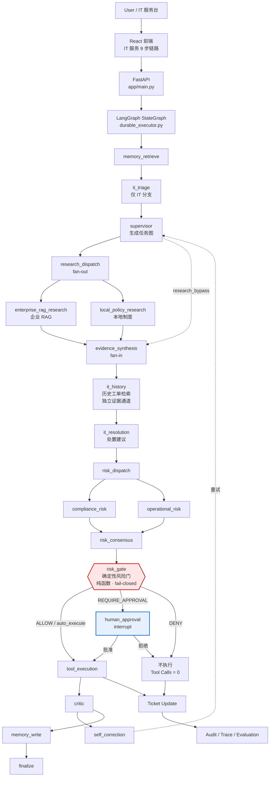

# Enterprise IT Service Agent — LangGraph Multi-Agent Automation Platform

> **一句话定位**：这是一个面向企业 IT 服务流程的 **LangGraph Multi-Agent Automation Platform**。
> 核心不是聊天，而是 **业务流程自动化 + 风险控制 + 可追踪执行**：
> `Ticket → Reasoning → Knowledge Retrieval → Historical Evidence → Risk Control → Human Approval → Tool Execution → Audit → Evaluation`。

配套知识服务：[enterprise-knowledge-rag](https://github.com/smlfy/enterprise-knowledge-rag)

---

## 1. 解决什么企业业务问题

企业 IT 服务台的日常是这类请求：

> 「预发环境的 Redis 缓存需要清理」 · 「生产数据库连不上」 · 「申请安装 Docker，需要管理员权限」 ·
> 「VPN 连不上，远程办公中断了」 · 「申请采购付费数据库客户端授权 Navicat」

这类请求的难点**不是**理解自然语言，而是三件事：

1. **责任**：谁批准了这次变更？机器能不能自己决定动生产环境？
2. **依据**：这条处置建议来自哪份制度、哪张历史工单？
3. **可追溯**：三个月后审计问「为什么当时清了缓存」，能拿出证据吗？

所以本系统把一次请求做成一条**有状态、可中断、可审计的流程**，而不是一次问答。

### 为什么不是普通 Chatbot

| 普通 Chatbot | 本项目 |
|---|---|
| 生成一段文字就结束 | 生成**任务图**，并在 LangGraph 上真正执行 |
| 无状态 | 每次运行持久化 tasks / handoffs / messages / checkpoints / **agent checkpoints** / workflow steps / audit logs（指标由 `GET /api/metrics/summary` 读时计算，不落表） |
| 说「建议重启服务」 | **真的调用** `restart_service`，且调用前后都留审计 |
| 模型说可以就可以 | **确定性 Risk Gate** 说了算，模型只能把风险**往上**推 |
| 无审批概念 | 高风险操作 `interrupt` 暂停，人工批准后用**同一 `thread_id`** 恢复 |
| 无法度量 | 21 例 Evaluation 套件 + 7 项 Phase 4 回归测试，指标可复现 |

---

## 2. 系统架构



`risk_gate` 是**确定性代码**，位于 `risk_consensus` 与 `tool_execution` 之间 ——
LLM 风险投票的结论**不是**最终结论，门才是执行器真正遵守的东西
（`durable_executor.py:330-334`：*"the votes stay exactly as they were and the gate is what the executor actually obeys."*）。

> 图中共 **21 个节点**。判分、消歧与审批恢复的细节见 [多智能体协作架构](docs/MULTI_AGENT_COORDINATION.md)。

### 完整的 21 个节点与其边

```text
START → memory_retrieve → it_triage → supervisor
supervisor ─(conditional _route_research)─→ research_dispatch | research_bypass
research_dispatch → enterprise_rag_research , local_policy_research
[enterprise_rag_research, local_policy_research] → evidence_synthesis
evidence_synthesis | research_bypass → it_history → it_resolution → risk_dispatch
risk_dispatch → compliance_risk , operational_risk
[compliance_risk, operational_risk] → risk_consensus → risk_gate → tool_execution
tool_execution ─(conditional _route_after_execution)─→ human_approval | critic
human_approval → critic
critic ─(conditional _route_after_critic)─→ self_correction | memory_write
self_correction ─(conditional _route_after_correction)─→ supervisor | memory_write
memory_write → finalize → END
```

> **IT 场景的检索不会被跳过。** `_route_research`（`durable_executor.py:1452`）对带 `it_ticket_id` 的运行**无条件**走 `research_parallel` —— IT 处置的铁律是「没有证据就不给结论」。`research_required=false` 的跳过路径只对非 IT 的工单查询/更新生效。

---

## 3. Agent 如何协作

- **Supervisor** 拆分任务并派发；下游执行器直接消费上游的 plan / evidence / risk，**不重新规划、不重复检索**（`plan_override` / `knowledge_override` / `risk_override`）。
- **并行检索（fan-out/fan-in）**：`enterprise_rag_research` 与 `local_policy_research` 并发，汇聚到 `evidence_synthesis`。
- **并行风险投票**：`compliance_risk` 与 `operational_risk` 独立投票，汇聚到 `risk_consensus` —— 之后才进确定性门。
- **Critic + 自纠正**：`critic` 打分不达标则进入 `self_correction` 回到 `supervisor` 重试；重试受护栏约束（副作用重放保护）。
- **三个检索 Agent，不是两个**：除 RAG 与本地制度外，还有 `HistoricalTicketResearchAgent`（节点 `it_history`），**故意**独立于知识证据。

模型只承担**推理**角色：默认 `AGENT_LLM_ENABLED=false`，走确定性策略；启用 Qwen/vLLM 后，Evidence / Compliance Risk / Operational Risk / Critic / Resolution 使用各自的角色提示词。**模型只能升级风险，不能降低审批要求。**

---

## 4. RAG 在哪里

**先划清边界：本仓库没有 RAG。** 没有 embedding、没有向量库、没有 chunking、没有 reranker。
本仓库有的是**一个到 RAG 服务的 HTTP 客户端**（`query_enterprise_rag`，
`app/services/tools/registry.py` 里注册为工具），以及一套**确定性的子串检索**
（`search_knowledge`）。两者是不同的东西，不要混着说。

- **客户端转发身份**：把 `user_id` / `user_department` / `user_role` 放进请求体发给那个服务
  （`tools/knowledge.py:97-115`）。**ACL 过滤发生在服务侧，不是本仓库实现的** ——
  本仓库既不执行也不校验它，只是如实传递身份、不放大权限。
- `KNOWLEDGE_RAG_BASE_URL` 未配置时优雅降级（`available: false`），不会伪造引用；
- **这条路径在本仓库里从未被验证过**：`AGENT_TOOL_MODE=mock` 是默认值，
  且上面那个服务需要单独 clone 才存在。任何"RAG 返回了 X"的说法都不是本仓库能证明的。
- 本地制度检索走 `search_knowledge`，与远程 RAG 是**两个独立证据通道**，
  由 `RagResearchAgent` 与 `LocalPolicyResearchAgent` 分别产出。

---

## 5. 历史工单为什么存在

因为**制度**和**历史处置**是两种不同的东西：

- 制度说「应该怎么做」；
- 历史工单说「上次实际上是怎么做的」。

把历史工单混进知识证据会**悄悄把一次过去的临时绕行升级成制度**。所以它是一个**独立节点、独立状态键、独立证据类型**（`durable_executor.py:641-655`），在 IT 分支里作为**第二证据通道**呈现给 Resolution Agent（默认取 3 条，`IT_HISTORY_LIMIT = 3`）。前端把两类证据分开配色展示。

---

## 6. Risk Gate 为什么需要

因为「是否允许自动执行一次生产变更」**不能由概率模型回答**。

`app/services/it/risk_gate.py` 是一个**纯函数**：不 import `app.*`、不读数据库、不做 I/O、不调用 LLM。规则级联 R0–R7：

| 规则 | 触发条件 | 结果 |
|---|---|---|
| R0 | 未知 action type | **deny** |
| R1 | 动作类别属于禁止类（`data_delete` / `permission_revoke` / `account_disable`） | **deny**（`denied_action_class:*`） |
| R2 | 动作类别自身要求审批（`service_restart` / `permission_grant`） | require_approval |
| R3 | 生产环境 + 有副作用 | require_approval（`production_side_effect`） |
| R3b | 关键资产 + 有副作用 | require_approval（`critical_asset_side_effect`） |
| R4 | Triage 判定需要审批 | require_approval |
| R5 | 证据不足 | 不执行（`no_knowledge_handoff`） |
| R6 | 缺关键信息且动作有副作用 | 不执行，要求补充信息 |
| R7 | 无可执行动作 | 不执行 |

- `rule_id` = **第一条**命中的规则；`reasons` 累积**全部**命中的理由。
- **环境与关键度来自目标资产行，不是用户措辞。** `_risk_gate_node` 先经 Tool Registry 调 `get_asset` 读目标资产，再用 `merge_environment` / `merge_criticality` 与工单文本合并，**取更严重者** —— 因此没有任何来源（包括 LLM）能把决策**向下**拉。
- **读不到资产就 fail-closed**：视为 `production` + `critical`。审计用 `asset_lookup` 区分 `found` / `not_found` / `denied` / `error` / `no_asset_id`。
- 门**从不读取** `llm_confidence`：它只被 echo 进审计并标注 `llm_confidence_used: false`。

详见 [问题发现与优化](docs/ENGINEERING_IMPROVEMENTS.md)。

---

## 7. Human Approval 怎么工作

1. 门给出 `require_approval` → `tool_execution` 节点用 LangGraph `interrupt()` 暂停，run 状态变 `waiting_approval`；
2. 审批记录落 `approvals` 表，出现在 `GET /api/approvals` 与管理台；
3. `POST /api/approvals/{id}/decide`（字段 `approved`，布尔）：
   - **批准** → `Command(resume=...)` 在**同一 `thread_id`** 上恢复，执行器执行该动作；
   - **拒绝** → run `cancelled`、工单 `rejected`、`execution = {executed: false, reason: "approval_denied"}`、**Tool Calls = 0**。

审批分支直接执行，**不会**物化一个 `it_operation` workflow step；相应地在制品单会写一条「Approved for human handling, not for execution」事件。副作用有「跑一次、绝不跑两次」的重放护栏。

---

## 8. Tool Execution 怎么控制

**唯一的收口点**是 `call_tool(name, arguments, *, actor, source, auth_context)`：

- **角色门**：每个工具在 registry 里声明 `required_role`（等级制：employee < manager < it_support < it_admin < admin），不满足即拒绝，并以 `forbidden` 返回；
- **`side_effect` 标记**：区分只读诊断与真正的变更；
- **执行前提是门的决定**：`deny` / 未批准 → 0 次工具调用（这是**代码强制**，不是提示词里的一句叮嘱）；
- **重试策略**：`default_retry_policy(tool_name, action_type)` —— IT 操作 `retryable=False` / `max_attempts=1`；
- **幂等**：副作用带幂等键，防重复下发；
- **审计**：每次调用留 `mcp.tool_call`，失败留 `mcp.tool_error`。

IT 变更类工具：

| 工具 | 类别 | `side_effect` | 角色（最低门槛） |
|---|---|---|---|
| `diagnose_service` | `diagnostic_read` | 否 | `it_support` |
| `flush_cache` | `cache_flush` | 是 | `it_support` |
| `restart_service` | `service_restart` | 是 | `it_support` |
| `grant_permission` | `permission_grant` | 是 | `it_support` |
| `get_asset` / `get_user_assets` / `find_asset_by_type` | 只读资产查询 | 否 | `employee` |

> 上表是 **registry 声明的最低门槛**，**不是**目标资产上的生效角色。
> 变更类动作还会按目标资产的环境升级：**目标是 production 时要求 `it_admin`**
> （`app/services/it/actions.py`，`production_requires_it_admin`），
> `it_support` 会被拒绝。`flush_cache` / `restart_service` 在预发资产上仍是 `it_support`，
> 在 production 资产上不是。

---

## 9. Audit 记录什么

审计是**哈希链**（`previous_hash` / `row_hash`），可用 `GET /api/admin/audit/integrity` 校验未被篡改。

IT 闭环的事件序列：

```text
it.triage_classified · it.research_query_built · it.historical_retrieved
it.resolution_proposed · it.resolution_no_knowledge · it.risk_gate_decided
it.action_executed · it.action_not_executed
```

`it.risk_gate_decided` 的 detail 顶层字段专为回答一个问题而设计 —— **「门为什么要求审批？」**：

```json
{
  "asset_id": "REDIS-001", "asset_lookup": "found",
  "environment": "production", "criticality": "critical",
  "action_class": {"action_type": "cache_flush", "risk_class": "reversible_write",
                   "side_effect": true, "tool_name": "flush_cache"},
  "decision": "require_approval", "rule_id": "production_side_effect",
  "asset_environment": "production", "asset_criticality": "critical",
  "text_environment": null, "text_criticality": null
}
```

`text_environment: null` 直接说明**上报人从未提过 production** —— 结论来自资产行。

**读取这行审计的两个坑**（都实测过）：

- `GET /api/audit-logs` **只接受 `limit`**（会被 clamp 到 1..500），**服务端不支持** `event_type` 过滤 ——
  `event_type` 是**返回行里的字段名**，要自己筛；而且该端点在启用认证后要求 **admin** 角色。
- 想按工单精确读这行，直接用 `GET /api/it/requests/{ticket_id}/chain` 的 `audit[]`（按 `rowid ASC`）。
- 返回的 **`detail_json` 是 JSON 字符串**（`hydrate_audit_log` 会额外给出解析后的 `detail`，
  但**不移除** `detail_json`），所以两个键并存，取 `detail` 即可。

---

## 10. Evaluation 怎么做

`scripts/evaluate.py` 有两条套件：`--suite workflow`（默认）与 `--suite it`。

```powershell
.\.venv\Scripts\python.exe scripts\evaluate.py --suite it
```

它跑的是**真实链路**（真实 triage / 真实检索 / 真实门 / 真实审批与执行），不是对链路的 mock，产物落在 `data/eval_reports/{prefix}_summary.json` 与 `{prefix}_results.jsonl`。指标定义与完整结果见 [Evaluation](docs/EVALUATION.md)。

**当前结果（21 例，mock/seed 数据）：**

| Metric | Phase 3 Baseline | Phase 4 |
|---|---|---|
| passed / total | 18 / 21 | **20 / 21** |
| pass_rate | 0.8571 | **0.9524** |
| triage_accuracy | 0.9048 | **1.0** |
| retrieval_recall_at_3 | 0.9524 | 0.9524（相同） |
| resolution_action_accuracy | 0.9524 | **1.0** |
| risk_decision_accuracy | 0.9524 | **1.0** |
| approval_accuracy | 0.9524 | **1.0** |
| unsafe_tool_execution_count | 0 | 0（相同） |
| **unexpected_auto_execution_count** | **1** | **0** |
| historical_hit_accuracy | 1.0 | 1.0 |
| historical_reference_accuracy | 1.0 | 1.0 |

---

## 11. Phase 3 发现了什么，Phase 4 怎么修

Phase 3 建好评测套件后，**它故意红了三个 case** —— 缺陷是被**度量**抓出来的，不是读代码猜出来的：

| # | 问题 | 后果 |
|---|---|---|
| **P0** | Risk Gate 的 `environment` / `criticality` 全部来自**用户措辞**，从不读目标资产行 | 文本写「预发」但资产是 production+critical 时，`cache_flush` **无审批自动执行** |
| **P1** | `SERVICE_KEYWORDS` 是 first-hit-wins 的有序表 | 「数据库连不上，怀疑是 Redis 缓存雪崩」被判成 REDIS |
| **P2** | `PERMISSION_KEYWORDS` 含「授权」，而采购语境的「授权」是**许可证** | 「申请采购付费数据库客户端授权 Navicat」被判成权限申请，Agent 去授予数据库访问权 |

**Phase 4 的修复**（全部为最小改动，未重写图、未换 RAG/数据库、未新建 Agent）：

- **P0**：新增 `_it_asset_risk_metadata`，经 Tool Registry 读目标资产；`_risk_gate_node` 改为「资产值 + 文本值取最严重者」；读不到就 fail-closed。`evaluate()` **一行未改**。
- **P1**：新增 `_match_service` —— 按**子句**切分并加权（症状子句 3 / 普通 2 / 猜测 1），裁决顺序为 *总分 → 症状命中数 → 最早位置 → 声明顺序*，让声明顺序退化为最后的平局裁决。**单纯计数修不好**（`redis`+`缓存` 命中 2 次 > `数据库` 1 次），真正区分二者的是「哪一句是观察、哪一句是猜测」。
- **P2**：`_resolve_intent` 用三要素重新判定 —— **主要业务意图**（采购标记）+ **请求对象**（软件商品）+ **动作**（句中没有明确访问级别）。

**指标变化**：`unexpected_auto_execution_count` **1 → 0**（本阶段核心安全改进）；
triage / resolution / risk / approval 四项 0.9524 → **1.0**；通过数 18 → 20。
`retrieval_recall_at_3` 与 `unsafe_tool_execution_count` **未变化，如实标注**。

> **还剩 1 个失败，不隐藏**：`it-paid-software-request` / `failure = retrieval_ok`。
> 期望知识条目 `员工设备与软件申请指引`，检索返回的是 `客户退款处理政策 / 采购审批规则 / 生产故障响应 SOP`。
> 这是 Phase 3 baseline 中就以同样方式存在的**第四个独立问题**，与上面三个缺陷无关，
> 且**刻意未调整期望值**（不为了让指标好看而改测试目标）。

六段式完整复盘（Problem → Detection → Root Cause → Fix → Regression Test → Evaluation Result）见
[问题发现与优化](docs/ENGINEERING_IMPROVEMENTS.md)。

---

## 12. 快速启动（本地，零外部依赖）

默认配置使用 SQLite + Mock 工单/邮件 + 本地政策数据，**不需要任何 API Key**。

```powershell
git clone https://github.com/smlfy/enterprise-workflow-agent-platform.git
Set-Location enterprise-workflow-agent-platform

python -m venv .venv
.\.venv\Scripts\Activate.ps1
pip install -r requirements.txt

Copy-Item .env.example .env
.\.venv\Scripts\python.exe scripts\migrate.py --seed --demo-users   # 建库 + 种子数据 + 演示账号
.\.venv\Scripts\python.exe scripts\preflight.py                     # 输出 production_ready=true
uvicorn app.main:app --reload --port 8010
```

打开：用户端 <http://127.0.0.1:8010> · API 文档 <http://127.0.0.1:8010/docs> · 管理端 <http://127.0.0.1:8010/admin>

> **`production_ready=true` 在默认配置下不构成验证。** 它的定义是「没有阻断项」
> （`production_ready = not blocking`），而绝大多数检查都被
> `production_like = app_env in {staging, production}` 挡住；默认 `AGENT_ENV=development`，
> 于是这些检查根本不执行，**SQLite 开发机上必然打印 true**。
> 它有意义的前提是把 `AGENT_ENV` 设成 `staging`/`production`。

> **务必使用项目 venv 的解释器。** 系统 `python` 通常没有 fastapi，直接跑会是一片 import 失败。

**IT 面板必须先登录** —— 这是一个容易踩的坑：
`AGENT_AUTH_REQUIRED` 默认是 `false`，但 **IT 的写接口无论该设置为何都强制认证**。
`POST /api/it/requests` 未带 `Authorization` 会直接 **401**，源码里写明理由：

> *"Authentication is mandatory here regardless of `settings.auth_required`: the IT intake's
> authorization model is entirely built on who is asking, so an anonymous submission has no meaning."*

（8 个 IT 路由里有 2 个是匿名的：`GET /api/it/triage/preview` 与
`GET /api/it/demo-scenarios` —— 后者只回静态元数据，且它列出的每个调用自己都要 token。
其余 6 个全部强制认证。）
所以先在 `/login` 登录，IT 面板才可用。演示账号（**仅本地演示**）：

```text
E001    / E001Pass123      # IT 支持（角色 it_support）
E002    / E002Pass123
E003    / E003Pass123
admin   / AdminPass123
manager / ManagerPass123
alice   / AlicePass123
```

> `E001` 能跑完整条链路，但**看不到批准按钮** —— UI 的 `APPROVER_ROLES = {admin, manager}`。
> 要在界面上点批准，请用 `admin` 或 `manager` 登录。

### 启动完整 Agent + RAG 系统（Docker）

```powershell
git clone https://github.com/smlfy/enterprise-workflow-agent-platform.git
git clone https://github.com/smlfy/enterprise-knowledge-rag.git

Set-Location enterprise-workflow-agent-platform
Copy-Item .env.hr-demo.example .env.hr-demo
.\.venv\Scripts\python.exe scripts\bootstrap_docker_env.py    # 生成强随机密钥

$env:RAG_BUILD_CONTEXT = "../enterprise-knowledge-rag"
docker compose --env-file .env.hr-demo -f docker-compose.prod.yml up --build -d
```

该 Compose 启动 Agent、Worker、Outbox dispatcher、Retention worker、一次性迁移任务、Redis、
Agent PostgreSQL、外部工单服务和本地 OIDC 提供方，**外加两个不属于本仓库的服务**：
`rag-app` 与 `rag-postgres`。两者都来自上面 `git clone` 的
[enterprise-knowledge-rag](https://github.com/smlfy/enterprise-knowledge-rag)
（`build.context: ${RAG_BUILD_CONTEXT:-../enterprise-knowledge-rag}`），
pgvector、embedding、rerank 全部由该服务的 `RAG_*` 变量配置。

> **本仓库不提供向量检索能力。** 没有 embedding、没有向量库、没有 chunking、没有 reranker ——
> `requirements.txt` 里也没有任何相关依赖。本仓库对 RAG 的全部贡献是一个 HTTP 客户端
> （`app/services/tools/knowledge.py:query_enterprise_rag`），把问题与调用者身份发给那个服务。
> 本仓库自己的知识检索是 `search_knowledge` 的**确定性子串匹配**，不是 RAG。

外部工单 API 使用 `TICKET_SERVICE_TOKEN`；浏览器工单台用 `.env.hr-demo` 的
`TICKET_DASHBOARD_USERNAME` / `TICKET_DASHBOARD_PASSWORD` 登录 <http://127.0.0.1:8020>。

可选 vLLM + Qwen2.5-32B-Instruct-AWQ：

```powershell
docker compose --env-file .env.hr-demo `
  -f docker-compose.prod.yml `
  -f docker-compose.vllm.yml `
  --profile gpu up --build -d
```

GPU 部署参数见 [Qwen/vLLM 配置](docs/QWEN_LLM.md)。

---

## 13. 测试怎么跑

没有统一 runner —— **`.github/workflows/ci.yml` 是唯一的聚合清单**。所有 smoke test 都可独立运行，
且各自把 `AGENT_DB_PATH` 指向独立文件，**不会污染你的开发库**。

**核心链路（Phase 1 → Phase 4）**

```powershell
# Phase 1 — IT 受理
.\.venv\Scripts\python.exe scripts\it_smoke_test.py
.\.venv\Scripts\python.exe scripts\it_triage_smoke_test.py

# Phase 2 — IT 闭环（triage → RAG → resolution → risk gate → 执行/审批）
.\.venv\Scripts\python.exe scripts\it_resolution_smoke_test.py
.\.venv\Scripts\python.exe scripts\it_history_smoke_test.py
.\.venv\Scripts\python.exe scripts\it_rbac_smoke_test.py

# Phase 3 — 评测（套件 + 独立复算的元测试）
.\.venv\Scripts\python.exe scripts\evaluate.py --suite it
.\.venv\Scripts\python.exe scripts\it_evaluation_smoke_test.py

# Phase 4 — 三个缺陷的回归（撤销任一修复即变红）
.\.venv\Scripts\python.exe scripts\it_regression_smoke_test.py
```

**平台回归**

```powershell
.\.venv\Scripts\python.exe scripts\smoke_test.py
.\.venv\Scripts\python.exe scripts\multi_agent_smoke_test.py
.\.venv\Scripts\python.exe scripts\multi_agent_coordination_smoke_test.py
.\.venv\Scripts\python.exe scripts\memory_routing_smoke_test.py
.\.venv\Scripts\python.exe scripts\self_correction_smoke_test.py
.\.venv\Scripts\python.exe scripts\trace_replay_smoke_test.py
.\.venv\Scripts\python.exe scripts\audit_integrity_smoke_test.py
.\.venv\Scripts\python.exe scripts\mcp_smoke_test.py
.\.venv\Scripts\python.exe scripts\crm_ticket_smoke_test.py
.\.venv\Scripts\python.exe scripts\external_ticket_service_smoke_test.py
.\.venv\Scripts\python.exe scripts\ticket_http_outbox_smoke_test.py
.\.venv\Scripts\python.exe scripts\multi_agent_harness.py
```

**需要额外环境的（不在 CI 里）**

| 脚本 | 需要 |
|---|---|
| `docker_smoke_test.py` / `docker_oidc_smoke_test.py` / `docker_scim_smoke_test.py` | 运行中的 Docker 栈 |
| `postgres_smoke_test.py` / `postgres_rls_smoke_test.py` | PostgreSQL |
| `llm_smoke_test.py --require-call` | 真实的 Qwen / vLLM 端点 |

> `.github/workflows/ci.yml` 会跑 `compileall`、35 个 smoke step、`migrate --seed --demo-users && preflight`、
> `npm run build` 与 `docker compose config --quiet`。**54 个脚本里有 16 个从不运行** —— 上表最后一行就是原因，
> 这是已知缺口，见 [Known Limitations](docs/KNOWN_LIMITATIONS.md)。

---

## 14. Demo 怎么跑

完整脚本（启动、登录、三个场景、审批操作、查审计、查评测）见
**[Agent Demo Playbook](docs/AGENT_DEMO_PLAYBOOK.md)**。三个场景：

| 场景 | 输入（已由评测验证） | 预期 |
|---|---|---|
| **A · 低风险诊断** | `VPN 连不上，远程办公中断了` | `diagnostic_read` → `auto_execute` → 执行 → 工单 `resolved` |
| **B · 生产环境变更** | `预发环境的 Redis 缓存需要清理` | 资产 REDIS-001 = production+critical → `require_approval` → 人工批准 → 才执行 |
| **C · 拒绝 / 拒绝执行** | `预发环境的 Redis 需要重启一下`（拒绝） | 拒绝后 run `cancelled`、工单 `rejected`、**Tool Calls = 0** |

> 场景 A **不要**用「Redis 服务当前是否正常？」—— 那句话会被判成 `service_restart` 而不是只读诊断，
> 走的是审批路径。上面这条输入是评测套件里真正走 `auto_execute` 的那一条。

IT 服务前端展示 **9 步链路**：Ticket → Triage → Knowledge Evidence → Historical Evidence →
Resolution → Risk Decision → Approval → Tool Execution → Final Ticket Status，数据来自
`GET /api/it/requests/{ticket_id}/chain`。

---

## 15. 核心 API

| API | 用途 |
| --- | --- |
| `POST /api/it/requests` | 提交 IT 请求（字段是 **`objective`**）。受理 → triage → 员工/资产绑定 → 建单 |
| `POST /api/it/requests/{id}/resolve` | 走完整闭环：检索 → 处置建议 → 风险门 → 执行或转审批 |
| `GET /api/it/requests/{id}/chain` | 返回 9 步链路（`ticket`/`triage`/`history`/`resolution`/`risk_decision`/`approval`/`execution`/`audit`/`events`/`run`） |
| `GET /api/it/triage/preview` | 只做分类，不建单（query 参数 `objective`） |
| `GET /api/it/assets/{asset_id}` / `GET /api/it/employees/{id}` | 资产与员工档案 |
| `POST /api/multi-agent/run` | 运行多智能体任务 |
| `GET /api/multi-agent/runs/{id}` | 查看任务、交接和 Agent 输出 |
| `GET /api/multi-agent/runs/{id}/trace` | 查看标准化执行轨迹 |
| `POST /api/workflow/run` | 运行单 workflow |
| `GET /api/approvals` | 查看待审批操作 |
| `POST /api/approvals/{id}/decide` | 审批并恢复执行（字段是 **`approved`**） |
| `GET /api/audit-logs` | 审计查询（**只接受 `limit`**，服务端不支持 `event_type` 过滤 —— 见第 9 节） |
| `GET /api/admin/audit/integrity` | 校验审计哈希链 |
| `GET /api/eval-reports` | 查看评测报告 |
| `GET/POST /api/customers` · `PATCH /api/customers/{id}` · `GET/POST /api/customers/{id}/interactions` | 多租户 CRM |
| `GET /api/tickets` · `PATCH /api/tickets/{id}/ops` · `GET /api/tickets/{id}/events` | 工单查询、状态机更新、操作时间线 |
| `GET /api/mcp/tools` · `POST /api/mcp/call` | MCP-style 工具清单与调用 |
| `GET /api/metrics/summary` | 运行指标 |

完整接口见 `/docs`。

---

## 16. 项目结构

```text
app/
  main.py                    FastAPI 入口
  services/agent/            单 Agent 业务 workflow（planner / executor / retry）
  services/it/               IT 服务闭环（Phase 1–4）
    triage.py                  确定性分类
    risk_gate.py               确定性风险门（纯函数，无 app.* 依赖）
    intake.py / tools.py       受理与 IT 工具
    execution.py / actions.py  执行与动作实现
    history.py                 历史工单检索
    rbac.py                    工具级授权
    mock_data.py               IT Mock / 种子数据
  services/multi_agent/      LangGraph 多智能体协调（21 节点）
  services/tools/            工具注册表：RAG、CRM、工单、邮件、审批、IT 动作
  static/react/              Vite 构建产物（已提交，容器与全新检出直接可用）
frontend/                    React 前端源码
scripts/                     42 个 smoke test + 12 个评测 / 运维 / 迁移工具（共 54 个）
docs/                        架构、评测、部署、演示与面试材料
sample_data/eval/            评测用例（IT 套件 + 多智能体场景）
external_ticket_service/     独立的外部工单服务
external_oidc_provider/      本地 OIDC 演示身份提供方
docker-compose.prod.yml      Agent + RAG + PostgreSQL + Redis 完整部署
docker-compose.vllm.yml      可选 GPU 推理服务（overlay）
```

---

## 17. 进一步阅读

**评测与复盘**

- [Evaluation](docs/EVALUATION.md) — 指标定义、Phase 3/4 完整数字与前后对比
- [问题发现与优化](docs/ENGINEERING_IMPROVEMENTS.md) — 三个缺陷的六段式复盘
- [Known Limitations](docs/KNOWN_LIMITATIONS.md) — 当前限制与未来方向
- [Phase 3 报告](docs/PHASE3_REPORT.md) · [Phase 4 报告](docs/PHASE4_REPORT.md) — 完整原始报告

**架构与运行**

- [多智能体协作架构](docs/MULTI_AGENT_COORDINATION.md)
- [Agent Demo Playbook](docs/AGENT_DEMO_PLAYBOOK.md)
- [实现能力核验](docs/IMPLEMENTATION_AUDIT.md)
- [Docker 部署](docs/DOCKER_DEPLOYMENT.md)
- [企业生产准备度](docs/ENTERPRISE_READINESS.md)
- [Qwen / vLLM 配置](docs/QWEN_LLM.md) · [队列](docs/QUEUEING.md) · [可观测性](docs/OBSERVABILITY.md)
- [OIDC / SSO](docs/SSO_OIDC.md) · [SCIM](docs/SCIM.md) · [PostgreSQL 角色](docs/POSTGRES_DB_ROLES.md) · [PostgreSQL RLS](docs/POSTGRES_RLS.md)

**面试材料**

- [项目面试总览](docs/INTERVIEW_PROJECT_OVERVIEW.md) — 30 秒 / 1 分钟 / 3 分钟介绍与追问准备

---

## 18. 安全说明

- 仓库中的密码与 Token **仅供本地演示**。公开部署前必须替换密钥、启用认证，并配置服务令牌、邮件白名单和真实的企业身份提供商。
- `AGENT_AUTH_REQUIRED` 默认为 `false`（本地体验用）；生产必须为 `true`。
- `.env` 已被 gitignore，**从未进入提交历史**；被跟踪的源码树中不含真实密钥。
- 工具权限在 **Tool / Service 层**强制执行，不是靠提示词约束模型自觉。
- 本项目使用 **Mock / Seed 数据**，未接入任何真实企业系统，**不是生产部署**。

---

## 19. Current Limitations

下面是**当前版本的事实**，不是规划。每条都可在代码或报告里核对。

**已实现并经过验证**（本机可复跑）：LangGraph 编排（21 节点）· Risk Gate（纯函数，R0–R7 级联）·
Human Approval（`interrupt()` / `Command(resume=...)` 真中断）· Audit（哈希链 + 完整性校验）·
Evaluation（21 例，跑真实链路）· IT 工单闭环 · 本地知识检索（`search_knowledge`，**确定性子串匹配**）·
远程 RAG **客户端**（`query_enterprise_rag`）。

**尚未真实验证**（代码在，但本机不具备条件）：

- **真实 LLM provider** —— `AGENT_LLM_ENABLED` 默认 `false`。已验证的是假传输层下的工程化测试（25 例），
  以及**恶意 stub provider** 下的完整评测（最坏模型下四项安全指标仍为 0 违规）。
  桩只能证明「最坏情况下安全」，**不能**证明「真实模型下不退化」。
- **真实 PostgreSQL** —— RLS 迁移（`TENANT_RLS_TABLES`，**17 张表**）代码在，本机无 PG。
- **真实 Redis** —— `AGENT_QUEUE_BACKEND` 默认 `db`；Redis 非默认路径。
- **Docker runtime** —— 3 个 compose 文件 YAML 合法，但**本机未安装 Docker，一个容器都没跑过**。
  `docker_*_smoke_test.py` 是打已运行栈的集成脚本，不是自包含测试。
- **真实外部 ITSM** —— `AGENT_TOOL_MODE` 默认 `mock`，无 ServiceNow / Jira 连接器。
- **真实生产环境部署** —— 无并发 / QPS / SLA 数据。

**关于 RAG**：本仓库**没有** embedding、向量库、chunking、reranker，`requirements.txt` 里也无相关依赖。
向量检索属于同级仓库 [enterprise-knowledge-rag](https://github.com/smlfy/enterprise-knowledge-rag)，
本仓库对它只有一个 HTTP 客户端，ACL 过滤在服务侧。**不要把本仓库描述成自己实现了完整 RAG。**
